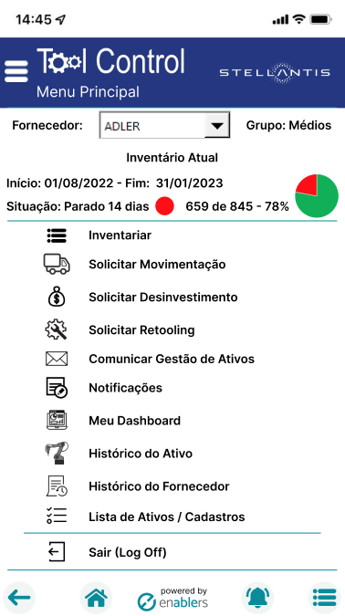

# Tool control APP

# Documentation:

- This project is created using expo and is licensed under the MIT license.

# Architecture

- `Screens` = App Screens

  - `Hooks` = Functions and integrations
  - `Components` = Components used in the screen
    - `Content` = Separation of the web and mobile version

- `Components` = Shared components

- `Contexts` = Contexts to shared data in the app

- `Navigation` = App navegation Screens

- `Services` = Endoints to integration

- `Styles` = Global styles

- `Utils` = Shared Functions to use in the app

## Screens

- Some app screens app screen

  
  

## Start project

- To start the project you need install the expo client and eas to build.
  `npm install -g expo-cli eas-cli` or `yarn add -g expo-cli eas-cli`

- Before start app you need run `yarn` or `npm i` to install the packages.
- Run `yarn start` our `npm run start` and press `a` on the button on keyboard to execute the android application.
- If you want to run the web version, you can use `w` on the button on keyboard.

# Build web

- To build the web version, you need use `yarn build:web` or `yarn build:web`
- If you want to build using docker, you need run `docker build -t tool-control .` and `docker run -it -d -p 3000:80 --name tool-control-web tool-control`

# Build mobile

- To build the web version, you need run the login on expo `expo login`.
- Insert your username or e-mail and password.
- Run the command `expo build` or `eas build --platform android`

# Verify errors

- If you want to see if the app has errors, run the command `expo doctor`
